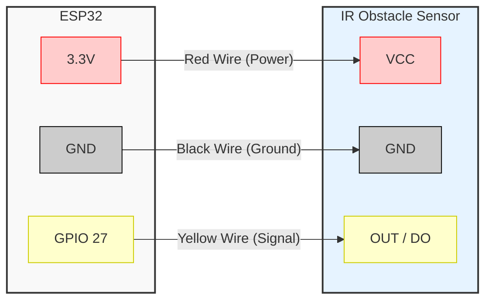

# ESP32 IR Sensor Presence Detector

A clean and efficient project for detecting presence using an ESP32 microcontroller and an Infrared (IR) Obstacle Avoidance Sensor. This setup reads the sensor's digital output and triggers an alert via the Serial Monitor and the onboard LED.

## Circuit Representation

The following diagram illustrates the wiring connections between the ESP32 and the IR Sensor module.

### Pin Mapping Table
| ESP32 Pin | IR Sensor Pin | Description |
| :--- | :--- | :--- |
| `3.3V` | `VCC` | Provides 3.3V power to the IR sensor. |
| `GND`  | `GND` | Common ground connection. |
| `GPIO 27` | `OUT / DO` | Digital signal output from the sensor. |

> **Note:** It is highly recommended to power the IR sensor using the 3.3V pin to ensure the logic levels match the ESP32's 3.3V tolerance.

## How It Works

1. **Initialization:** The ESP32 initializes Serial communication at 115200 baud and configures GPIO 27 as an input.
2. **Polling:** In the main loop, the ESP32 reads the digital state of the IR sensor every 500 milliseconds.
3. **Logic Handling:**
   - The sensor uses active-low logic.
   - When an object is detected, the sensor outputs a `LOW` signal. The ESP32 prints "Presence Detected!" and turns on the onboard LED (GPIO 2).
   - When the path is clear, the sensor outputs a `HIGH` signal. The ESP32 prints "No Presence" and turns off the LED.

## Quick Start Guide

1. Connect the ESP32 and the IR sensor according to the circuit diagram above.
2. Open the `ESP-32 test code IR sensor.ino` file in the Arduino IDE.
3. Select your ESP32 board model and appropriate COM port.
4. Click **Upload** to flash the code to your microcontroller.
5. Open the **Serial Monitor** and set the baud rate to `115200`.
6. Place an object in front of the IR sensor to observe the presence detection in real-time.
# ESP-32-IRsensor-test-code-
